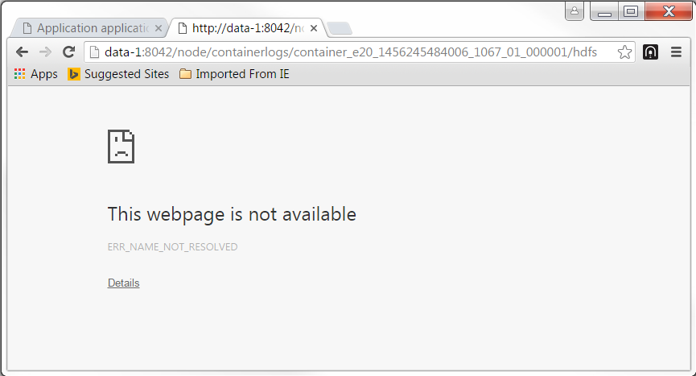
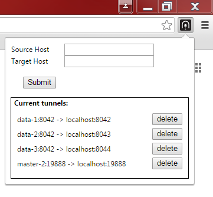

# TunnelResolver

Imported from https://github.com/klinvill/TunnelResolver

This is a quick and rough **chrome** extension I created that will allow you to make a list of hosts that your browser will automatically redirect. This was all done with the intention of making my work day a little easier. 

When working with a Hadoop cluster I didn't have direct network access to, I frequently had to tunnel into the cluster through a secured proxy. This ended up being a pain to work with several of the UIs (namely the resource manager) that various hadoop components provide. They would often forward me to a similar UI view on a different node. Since I was outside the cluster, I had to manually and frequently change the address it was sending me to. As a result, I decided to make an extension to do a simple redirection when I encountered an address I needed to change.

Note that I use the word tunnel incorrectly in the following instructions. This extension does not replace tunneling but rather makes it easier for you to use those tunnels from your browser. Instead all this extension really does is it redirects you away from the source host you've specified and to the associated target host.

## Installation Instructions
You can install this extension either from the crx file in the deploy directory or by building this extension from the source code. If you choose to go the crx route, make sure to check that the crx file is up to date with the source code.

#### To install the extension from the crx file

1. Navigate to [chrome://extensions](chrome://extensions)
2. Turn on Developer Mode (check the box)
3. Drag and drop the crx file onto the extensions page
4. Click Add Extension on the popup dialogue

#### To install the extension from the source code
1. Navigate to [chrome://extensions](chrome://extensions)
2. Turn on Developer Mode (check the box)
3. Click on the Load unpacked extension.... button
4. Select the tunnelresolver/src/TunnelResolver directory and click ok

## Usage Instructions

#### Add a tunnel (add host to automatically redirect)
1. Click on the TunnelResolver icon in the upper right-hand corner of your browser

2. Enter the source and target host information in the boxes. The source host will be the host that gets translated to the target host. So if you wanted foo/1 to redirect you to bar/1, you'd put foo in the source box and bar in the target box.  

3. Click submit, the information you specified will pop up under the current tunnels label  

#### Removing a tunnel
1. Click on the TunnelResolver icon in the upper right-hand corner of your browser

2. Click the delete button next to the tunnel you want to delete

#### Using the tunnels you set up
1.  You're done! The redirecting takes care of all the work for you.It's important to note that only the host is replaced. So if you type in foo/1, you'll be redirected to bar/1, even if bar/1 is an invalid URL. 

For a quick example of redirection, setup www.apple.com as a source and www.google.com as the target. Then navigate to www.apple.com and you'll be taken to www.google.com.

  

As a bonus, we can setup up redirection between multiple hosts. So for example we can add google as a source and teradata as a target, then navigating to www.apple.com will end up redirecting you to www.teradata.com!

## Sample usage: Hadoop Resource UI Tunnel Resolution
One good use case for this browser extension (and the reason I created it in the first place) is for resolving UIs of multi-node systems you don't have direct access to. 

##### The Scenario
You're running a job using YARN as the resource manager. You want to take a look at the logs of the job. The easiest way to look at the logs is to use the resource manager UI pictured below. The resource manager has a link that will take you directly to the log location. Unfortunately in order to do this, it redirects you to the node the job was executed on (data-1) and then redirects you to the master node that holds the logs. You don't have direct access to either of these nodes but you can tunnel into the nodes and can setup port forwarding. Once you've setup the port forwarding, you can use TunnelResolver to automatically redirect the URLs you can't access (for instance those with data-1) to URLs you can access (for instance localhost).

##### Initial Setup
In order to use TunnelResolver in this scenario, you need to first gain access to the system and setup port forwarding. I'm assuming that you already have indirect connectivity to the cluster (using something like Axeda Service Connect). Once you have connectivity, you need to setup port forwarding. If you're on a mac or a linux computer, you can do this using the terminal. If you're on windows, there are several clients you can use but I personally use PuTTY.

1. If you're using putty, click on the tunnels tab, add source and destination information, and then connect to the system. There are several tutorials online for how to do this if it's your first time. You can find one of them [here](http://howto.ccs.neu.edu/howto/windows/ssh-port-tunneling-with-putty/).  

2. Open up the resource manager UI. If the resource manager UI is on a different node than the one you connected to, you'll need to setup port forwarding to that node. I connected to an edge node but the resource manager UI was on a master node. You can establish the additional tunnel using the ssh -L command. After you're done, your port forwarding scheme will look something like this:  
MyComputer:8088 ===> EdgeNode:8088 ===> ResourceManagerUINode:8088  

3. You should now be able to get to the resource manager UI using the port forwarding scheme you setup. Now try navigating localhost:8088 to pull up the UI. Click on an application to see the details of a specific job.  

4. The job I clicked on above ran on data-1:8042. If you click on the logs link to see the logs, you should see a "webpage not available" message. The URL will be pointing to the node the job ran on (in this case data-1:8042). You'll need to change the URL to a URL you can access (such as localhost:8042) and you'll have to setup port forwarding for that host and port if you haven't done so already (both between your computer and the node you've connected to using putty or the terminal, and between the node you've connected to and data-1).  
  

5. Once you've setup port forwarding, you should be able to navigate to data-1:8042 using a host you can access.  

6. Unfortunately that link redirects to a different master node and port so you'll need to setup port forwarding again.  

7. You should now see be able to see the logs for the job! That was quite the process but now we're ready to setup TunnelResolver  

##### Add tunnels to TunnelResolver
Now it's time to add the tunnels. TunnelResolver will automatically redirect from the URLs you can't access to those you can (in our case it will redirect data-1:8042 to localhost:8042 and master-2:19888 to localhost:19888).

1. Click on the TunnelResolver icon in the upper right-hand corner of your browser

2. Enter the source and target host information in the boxes. In this case you'll want to add two tunnels, the data-1 tunnel and the master-2 tunnel.  
  
  

3. Click submit, you should see the tunnels you entered under the Current tunnels section.

4. Add more tunnels if desired. In this example there are three different data nodes that a YARN could manage a job from.   

##### Using the tunnels
Now that you have the port forwarding and TunnelResolver setup, you can navigate to the logs by simply pulling up the resource manager and clicking on the logs link. TunnelResolver will take care of the URL redirection for you!

 
 
 